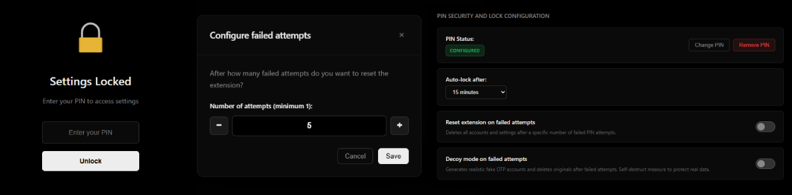

# 2FA Manager Local Extension

I was a long-time user of KeePassXC and Protonpass, but based on my experience as a user, I wanted something a little more flexible, easier to use, secure, and with local privacy features that didn't rely on any servers. That's why I decided to create a simple extension adapted to the Chromium and Firefox browsers to easily manage OTP codes. You can configure the privacy level by adding a PIN to unlock the extension. This PIN is stored in the cache in encrypted form with a final salt based on SHA-256 with the PBKDF2 algorithm. 

There are other higher levels of privacy, such as camouflaging the extension as if it were an extension for downloading videos from x.com (Twitter), adding a limit on failed attempts and configuring a response to this, such as resetting the extension and adding 30 random and realistic OTP accounts as a counterintelligence method. This is a security method to prevent brute force attempts and other attacks from a potential attacker.


## Local installation based on the source code on GitHub: 

### Chromium Browsers (Chrome, Edge, Brave)

1. Download or clone this repository
2. Open your browser and navigate to `chrome://extensions/` (or `edge://extensions/` for Edge)
3. Enable developer mode using the toggle in the top right corner
4. Click "Load unpacked" button
5. Select the folder containing the extension files
6. The extension will appear in your toolbar

### Firefox

1. Download or clone this repository
2. Open Firefox and navigate to `about:debugging#/runtime/this-firefox`
3. Click "Load Temporary Add-on"
4. Navigate to the extension folder and select the `manifest.json` file
5. The extension will be loaded temporarily (note: it will be removed when Firefox restarts)

**For permanent installation in Firefox:**
1. Package the extension as a `.xpi` file or submit it to Firefox Add-ons
2. Alternatively, use Firefox Developer Edition or Nightly for persistent temporary extensions

### Chrome Web Store / Firefox Add-ons (Coming Soon)

The extension will be available on official stores soon.

## Security



- **Local Storage**: Secrets are stored only in your browser
- **No Internet Connection**: The extension works completely offline
- **Open Source**: You can review all the source code
- **No Telemetry**: No data is sent to external servers
- **PIN Protection**: Lock the extension with a security PIN
- **Auto-lock**: Automatic locking after inactivity
- **Decoy Mode**: Protection against unauthorized access attempts

## Development

### Project Structure

```
2FA-Extension-local/
├── manifest.json       # Extension configuration
├── popup.html          # Main popup interface
├── popup.css           # Popup styles
├── popup.js            # Popup logic and account management
├── settings.html       # Settings page interface
├── settings.css        # Settings page styles
├── settings.js         # Settings configuration logic
├── content.js          # Content script for floating window injection
├── content.css         # Floating window styles
├── totp.js             # TOTP code generator (HMAC-SHA1)
├── security.js         # PIN encryption and authentication
├── security-test.js    # Security testing utilities
├── decoy.js            # Decoy mode implementation
├── i18n.js             # Internationalization support
├── icons/              # Extension icons
├── images/             # Screenshots and documentation images
└── README.md           # This file
```

### Technologies Used

- **Manifest V3**: The latest version of Chrome extensions
- **Vanilla JavaScript**: No external dependencies
- **CSS Grid/Flexbox**: For responsive layouts
- **Web Crypto API**: For secure HMAC-SHA1 code generation

### Contributing

1. **Fork** the repository
2. **Create a branch** for your feature (`git checkout -b feature/new-feature`)
3. **Commit** your changes (`git commit -am 'Add new feature'`)
4. **Push** to the branch (`git push origin feature/new-feature`)
5. **Create a Pull Request**

## License

This project is licensed under the MIT License. See the `LICENSE` file for more details.